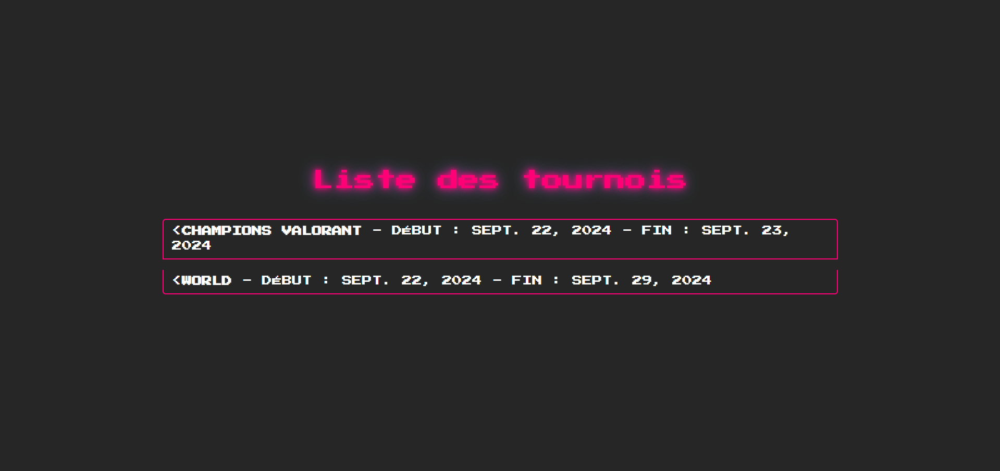
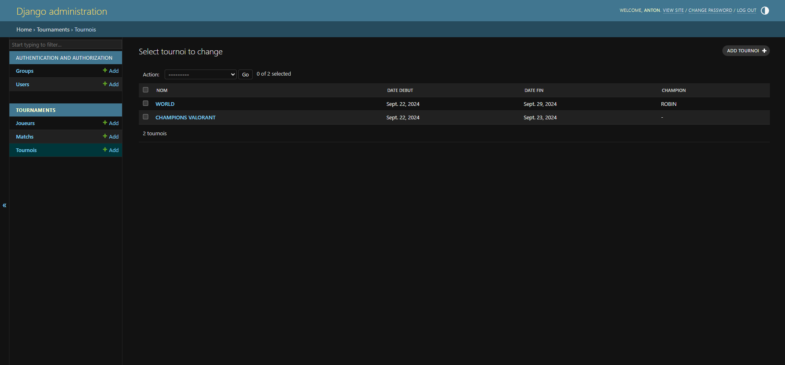
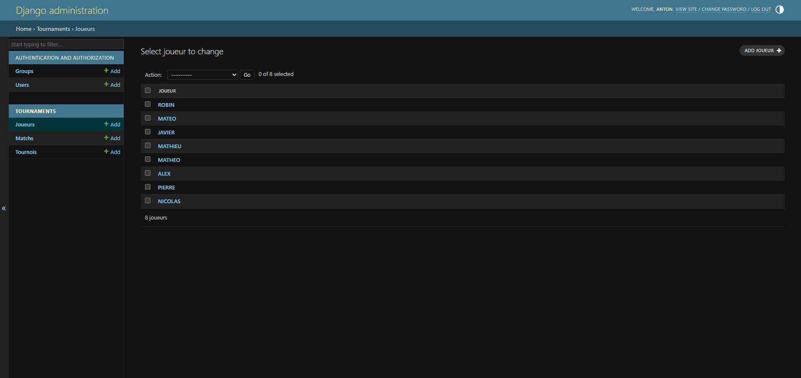
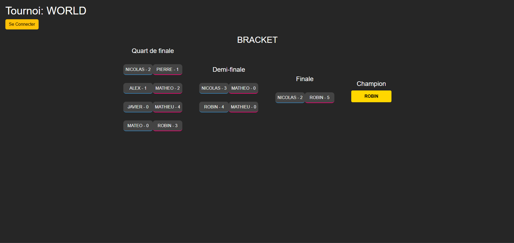

# Tournament Management System

Ce projet est une application de gestion de tournois permettant d'organiser, suivre et gérer différents types de compétitions.

## Fonctionnalités

- Création et gestion de tournois
- Inscription des participants
- Génération automatique des matchs
- Suivi des scores et des classements
- Interface utilisateur intuitive

## Prérequis

- [Node.js](https://nodejs.org/)
- [npm](https://www.npmjs.com/) ou [yarn](https://yarnpkg.com/)

## Installation

```bash
git clone https://github.com/LAMANTAIN/TOURNAMENT
cd TOURNAMENT
npm install
```

## Utilisation

```bash
npm start
```

Accédez à l'application via `http://localhost:3000`.

## 🎯 Aperçu de l'application

### 🏠 Page d'accueil


### 🛠️ Création d’un tournoi


### 👤 Vue joueur / inscription


### 🏆 Bracket de tournoi


## Licence

Ce projet est sous licence MIT.
